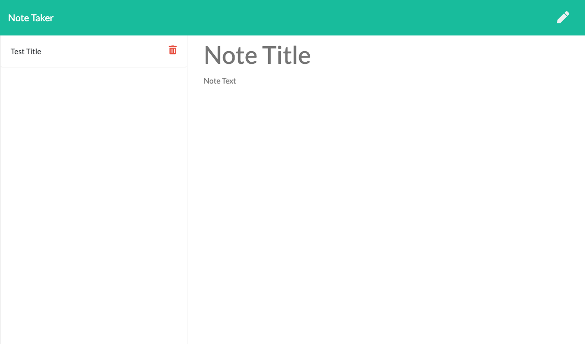

# note-taking-app

## Description 

Simple note taking app! When users navigate to the note taking page, they are able to write notes and save them. When a user clicks on a saved note in the left hand column the saved note populates the page. When the user is ready to delete a message, each message can be deleted by clicking the trash can next to each saved note. 

[Deployed Site](note-taker-iand.herokuapp.com/)

## Table of Contents

- [Description](#description)
- [Installation](#installation)
- [Usage](#usage)
- [Contributing](#contributing)
- [Testing](#testing)
- [Questions](#questions)
## Installation

- Node
- express
- path

## Usage

Once all packages are installed run `node server.js` in the command line of the terminal to begin the server. Navigate to your local host to preview the file or utilize a hosting website to actively deploy

## Contributing

Ian Darland

## Questions

Email: ianpdarland@gmail.com

[Github](www.github.com/iandarland)